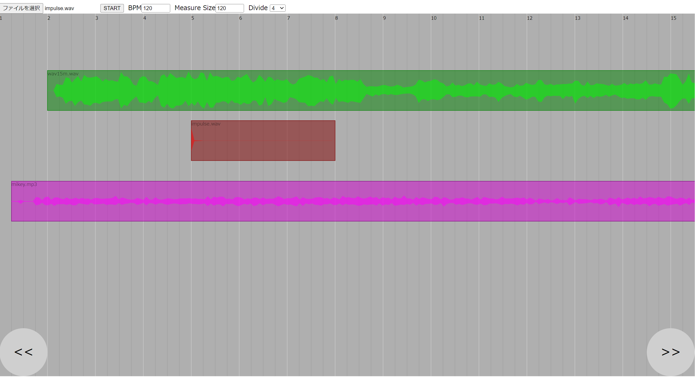

# AudioPlayer

This app is music player using Web Audio API.

You can arrange some audio files on grid lines, playback them same time, mixing them and download it.

## Screenshot




## How to run

Please execute following commands.

```
$npm i
$npm run build
$npm start
```

After above, open Chrome browser and access to ``http://localhost:8080``.

## Rependncy

- [waveform-data.js](https://www.npmjs.com/package/waveform-data)
- [audiobuffer-to-wav](https://www.npmjs.com/package/audiobuffer-to-wav)


